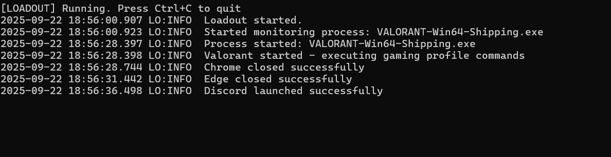

# Loadout


**Windows loadouts — more than a gaming mode, customized sessions for everything you do.**

**Loadout** is a lightweight desktop session tool for Windows. It applies your *customized loadouts* — sets of actions that shape your session, whether that’s closing browsers and launching Discord or OBS for gaming, or opening VSCode, Notion, and Spotify for a dev sprint.

> Prototype stage, expect bugs and breaking changes.

---

## Demo

**Current prototype in action:**

[](https://youtu.be/r2Zaor9yPTA)

> *When Valorant starts → automatically closes browsers + launches Discord & OBS*

---

**Terminal Output Screenshot:**



> *Early prototype verifying Valorant launch, then executing automation commands.*

---

## Features

* Customized loadouts for different sessions like gaming dev or work
* Automatic app management based on triggers
* Command system to do things like launch apps kill tasks open urls or set up workspaces
* Event-driven architecture with logging

---

## Quick Start

Run the prototype to try applying a gaming session automatically:

```bash
# build
cmake --preset default && cmake --build --preset default

# run
./loadout.exe
```

When Valorant starts the prototype will close browsers and launch Discord + OBS (demo in repository).

---

## Example loadouts (JSON)

Loadouts are JSON-based objects that describe triggers and actions. Below are example **formats** and two sample loadouts to illustrate the intent — the JSON loader/profile system is planned for future updates.

### Loadout JSON schema (example)

```json
{
  "name": "string",
  "description": "string",
  "triggers": [
    {
      "type": "process_started",
      "process_name": "string"
    }
  ],
  "actions": [
    {
      "type": "close",
      "process": "string"
    },
    {
      "type": "launch",
      "path": "string",
      "args": "string"
    },
    {
      "type": "open_url",
      "url": "string"
    },
    {
      "type": "workspace",
      "setup": "string"
    }
  ]
}
```

### Sample: Gaming loadout

```json
{
  "name": "Valorant Gaming",
  "description": "Close browsers open Discord and OBS when Valorant starts",
  "triggers": [
    { "type": "process_started", "process_name": "VALORANT-Win64-Shipping.exe" }
  ],
  "actions": [
    { "type": "close", "process": "chrome.exe" },
    { "type": "close", "process": "msedge.exe" },
    { "type": "launch", "path": "C:\\Program Files\\obs-studio\\bin\\64bit\\obs64.exe", "args": "" },
    { "type": "launch", "path": "C:\\Users\\tadit\\AppData\\Local\\Discord\\Update.exe", "args": "--processStart Discord.exe" }
  ]
}
```

### Sample: Dev loadout

```json
{
  "name": "Coding Sprint",
  "description": "Open VSCode Notion dev tools and Spotify",
  "triggers": [
    { "type": "manual", "trigger_name": "dev-session" }
  ],
  "actions": [
    { "type": "launch", "path": "C:\\Users\\tadit\\AppData\\Local\\Programs\\Microsoft VS Code\\Code.exe", "args": "" },
    { "type": "open_url", "url": "https://notion.so" },
    { "type": "launch", "path": "C:\\Users\\tadit\\AppData\\Roaming\\Spotify\\Spotify.exe", "args": "" },
    { "type": "workspace", "setup": "frontend-dev" }
  ]
}
```

> These are examples for clarity. The repository currently implements process-watcher and command execution. Full JSON profile loading and GUI are planned.

---

## Roadmap (planned)

* JSON-based customized loadout profiles import and export
* GUI for managing loadouts and profile customization
* Extended command system for workspaces multi app flows and environment setup

---

## How to contribute

* Open an issue for bugs or feature requests
* PRs welcome — follow the coding style in the repo and add tests where applicable

---

## License

Apache License 2.0 — see [LICENSE](LICENSE) for details.
